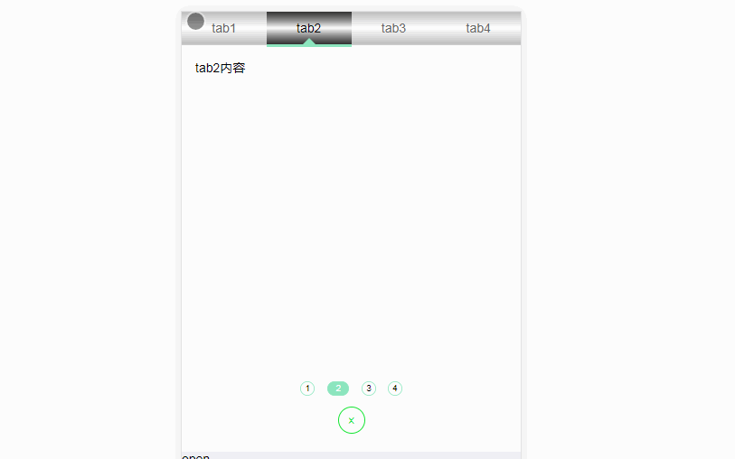
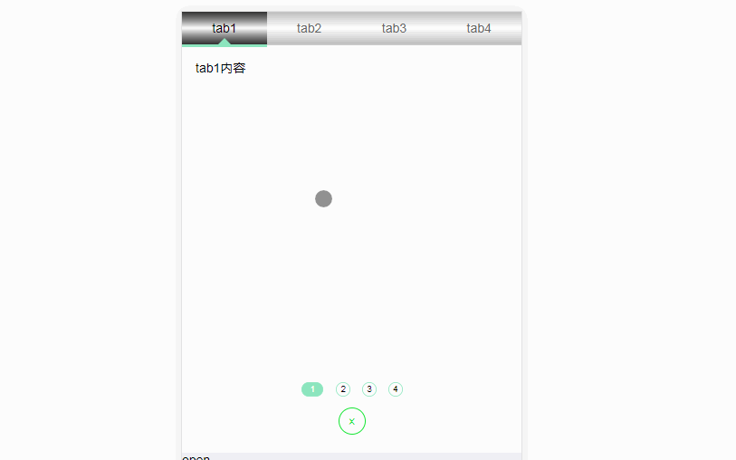

# Vue-SwiperTab
基于Vue的，支滑动过渡的tab切组件

# Screenshots
1. slidable (支持滑动，过渡，支持滑到一定位置，大于一定速度时自动滑动到下一项)
    
1. disable slide (禁止滑动以及动画过渡，简单的用法就是显示隐藏)
    


# Usage
demo.vue
```
<template>
    <swiper-tab animate v-model="active">
        <swiper-tab-header>
            <swiper-tab-item>
                tab1标题
            </swiper-tab-item>
            <swiper-tab-item>
                tab2标题
            </swiper-tab-item>
            <swiper-tab-item>
                tab3标题
            </swiper-tab-item>
        </swiper-tab-header>
        <swiper-tab-body>
            <swiper-tab-item>
                tab1内容
            </swiper-tab-item>
            <swiper-tab-item>
                tab2内容
            </swiper-tab-item>
            <swiper-tab-item>
                tab3内容
            </swiper-tab-item>
        </swiper-tab-body>
    <swiper-tab>
</template>
```
```javascript
import { SwiperTab, SwiperTabHeader, SwiperTabBody, SwiperTabItem } from "../components/swiper-tab"
export {
    data(){
        return {
           active: 1
        }
    },
    components: {
        SwiperTab, 
        SwiperTabHeader, 
        SwiperTabBody, 
        SwiperTabItem
    }
}
```

# Settings

 
 属性 | 用法说明 | 可选类型 | 可设置的值 | 默认值| 依赖的属性 | 影响的属性  | 其他说明
 :------|:------|:-----------:|:----------:|:---------:|:---------:| :-----:|:-------
 `wrapperCls` | 最外层容器的自定义样式class | `String` | `样式class` | `""` |`无` | `无` | 用来覆盖默认样式，允许用户自定义样式
 `show` | 设置组件显示隐藏 | `Boolean` | `true, false` | `true`|`无` | `无` | 允许用户在组件外部控制组件显示隐藏
`slidable` | 设置内容区域是否可滑动 | `Boolean` | `true, false` | `false` | `无` | `animate` | 当设置了`slidable`时，会覆盖`animate`属性，因为可以滑动的前提必须要启动动画设置
`synctab` | 同步滑动改变tab的active状态 | `Boolean` | `true, false` | `false` | `slidable` | `无 `| 设置header区域的tab,是否根据内容滑动实时变化active状态
`animate` | 启动动画过渡效果 | `Boolean` | `true, false` | `false` |`无` | `无` | 设置此属性点击header区域的tab内容会出现滑动的效果
`value` | 初始化显示第几个 | `Number` | `0, 1....等tab索引值` | `0` | `无` | `无` | `从0开始`， 默认第一个，使用的时候建议使用`v-model="x"`，这样组件外部，用户可以获取到当前是显示的是第几个
`speed` | tab切换一次，动画耗时 | `Number`, `String` | 像`100`, `300`等数字，或者可以转换成数字的字符串`单位为毫秒` |  `300` | `animate`, `slidable`| `无` | 此属性依赖动画，所以必须设置`animate`， `slidable`启动动画，如没有设置动画，则属性会被忽略
`distance` | 自动切换最小位置 | `Number`, `String` | 像`0.1`, `0.6`等在大于`0`,小于`1`的数字，或者可以转换成数字的字符串 | `0.5` | `slidable` | `无` | `0.5`表示在可以滑动的基础上，内容区域滑动到容器的一半时，内容区域会自动滑向下一个tab,在使用此属性时，必须先设置`slidable`,让内容区域可以滑动，当没有设置`slidable`，此属性会被忽略
`closebtn` | 显示关闭按钮 | `Boolean`, `String` | `true`,`false`,`字符串` | `false` |  `无` | `无` | 设置为布尔值的时候，或者经过trim以后为空的字符串，使用默认样式`x`的圆形关闭按钮；设置为非空字符串，展示一个长方形的带传入文案的按钮
`cursor` | 启用header区域游标 | `Boolean`, `String` | `true`,`false`,`可以表示颜色值字符串` |  `false` |`无` | `synccursor` | 当设置为布尔值`true`和`空字符串`的时候，启动默认样式的游标；设置为表示`颜色值`的字符串`（如 red,#eee, rgba, rgb等）`，则游标的颜色为设置的颜色, 若想更大程度的自定义，组件内部样式，可设置`wrapperCls`属性，进行自定义样式设置,同时这个属性和`slidable`影响`synccursor`属性，因为只有启动了游标，才可以设置同步移动的游标，不过默认游标就是同步的，如果不禁用同步移动,`synccursor`就可以不用设置了
`synccursor` | 同步移动的游标 | `Boolean` | `true`,`false`|  `true` | `slidable, cursor` | `无` | 使用这个属性可以在滑动的时候，游标也跟着移动，效果同`synctab`,就是在滑动到设置的`distance`边界位置时，游标的中心会指向下一个tab，本属性依赖`slidable`（可滑动属性），同时也依赖`cursor`（启动游标的属性）


